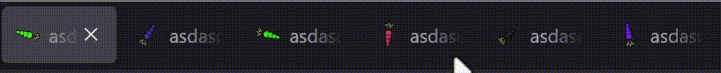

Copy of Chrome's tab groups using WebExtApi:
  - create groups 💴💴
  - rgb colors (more than chrome's 10) 🔴🟢🔷
  - custom name 🖊️
  - hide/unhide tabs 🫣
  - drag tab to add/remove from group 
  - 
  - 360deg carrots 🥕:
  - 
